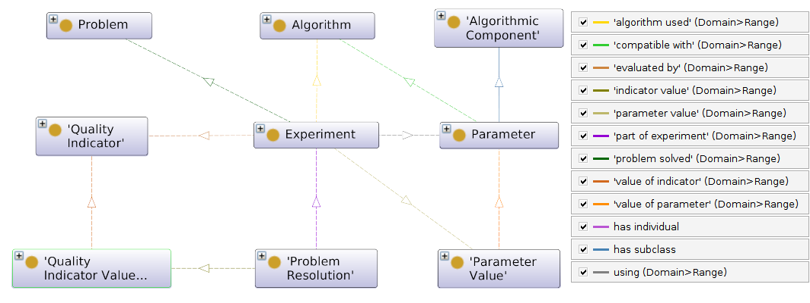

# [](https://w3id.org/moody)  moody
[](https://gitlab.com/jfaldanam-phd/moody/-/commits/master)
[](https://gitlab.com/jfaldanam-phd/moody/-/releases)
[](https://doi.org/10.5281/zenodo.7458095)


# Documentation
Use [`pylode`](https://github.com/RDFLib/pyLODE) to generate the documentation
```console
$ python -m pylode moody.owl -o docs.html
```

# Class diagram
